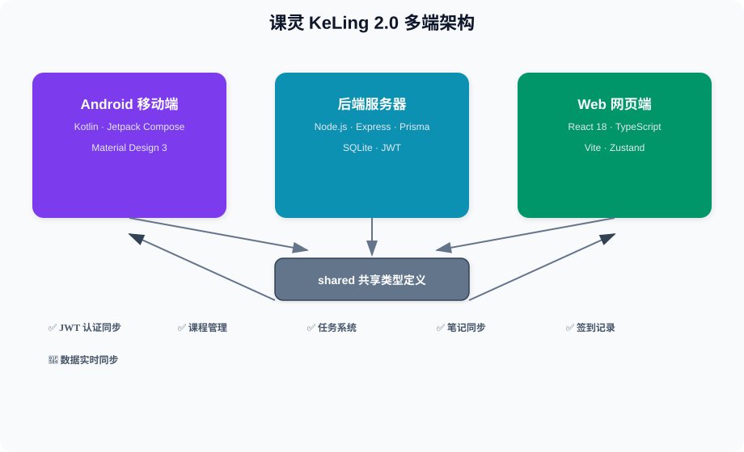

  

**🌱 多端知识管理应用 · 培育你的知识星球**

---

## ✨ 核心功能

| 特性 | 说明 |
|------|------|
| 📱 **Android 移动端** | Kotlin + Jetpack Compose + Material Design 3 + MVVM |
| 🌐 **Web 网页端** | React 18 + TypeScript + Vite + Zustand + Framer Motion |
| ⚙️ **后端服务** | Node.js + Express + Prisma ORM + SQLite + JWT |
| 🔄 **数据同步** | 多端共享同一后端 API，用户数据实时同步 |
| ✅ **核心功能** | 用户认证、课程管理、任务系统、笔记同步、每日签到 |

## 🏗 多端架构

---

---

**Made with ❤️ by Hyhyhyyy**

